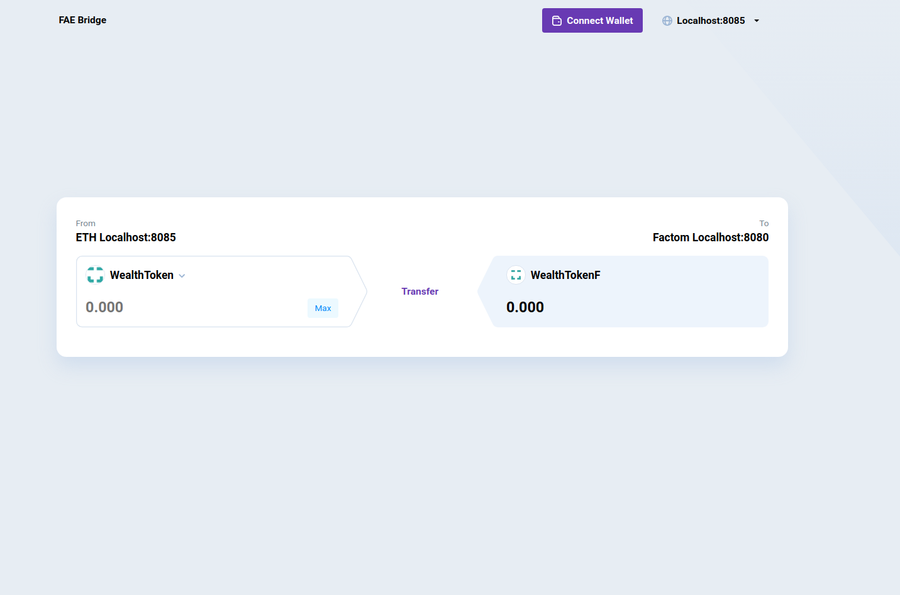

# Web UI

Simplified app that allows east token transfer between Factom and Ethereum. Browser should have MetaMask installed and active connection to FAT courtesy node.



App calls client binary that executes contracts deployed on the network.

## Running

```
yarn start
```
Starts the development server.

```
yarn build
```
Bundles the app into static files for production.

```
yarn test
```
Starts the test runner.

```
  yarn eject
```
Removes this tool and copies build dependencies, configuration files
    and scripts into the app directory. If you do this, you can’t go back!

We suggest that you begin by typing:

```
  cd fae-ui
  yarn start
```
